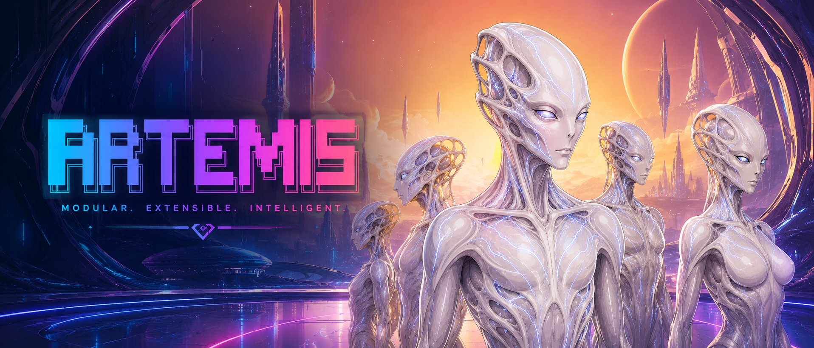

# Artemis

<p align="center">
  
</p>

<p align="center">
  <strong>An uncompromising AI coding agent and visual director. Local-first workspace integration, infinite context stability, and elegant autonomous execution.</strong>
</p>

<p align="center">
  <a href="https://www.npmjs.com/package/artemis-code"></a>
  <a href="LICENSE"></a>
  <a href="https://nodejs.org">= 20" /></a>
</p>

<p align="center">
  Crafted by <a href="https://www.420.company">420.COMPANY</a> · npm: <a href="https://www.npmjs.com/package/artemis-code"><code>artemis-code</code></a> · GitHub: <a href="https://github.com/420company/artemis"><code>420company/artemis</code></a>
</p>

---

## English

### Meet Artemis
Artemis is not a chatbox that spits out code snippets for you to manually copy and paste. She is your local-first, autonomous engineering assistant and creative visual director.

She enters your workspace, comprehends your repository's architecture, writes the code, executes the terminal commands, runs the tests, and only reports back when the task is verifiably complete. You focus on the vision; Artemis handles the execution.

Current Release: **0.2.51**

### What She Can Do For You

#### 🛠️ Autonomous Engineering
Tell Artemis what feature to build or what bug to fix. She will inspect your files, edit the source code using precise differential patches, add missing tests, and run your build scripts. If she encounters an error, she will independently read the logs and fix it until the build turns green. 
**How to use:** Simply type your request, or use `/team` to let her choose the best routing strategy. For long, complex refactoring, use `/nidhogg` to send her to the background so she can work while you focus on other things.

#### 🧠 Persistent Memory & Infinite Context
Artemis never forgets. She uses an Enterprise-Grade Persistent Collapse Ledger to save her memory, terminal outputs, and file snapshots straight to your local disk. If your computer crashes or you close your laptop, you can pick up the conversation exactly where you left off. 
**How to use:** Your memory is automatically managed, but you can explicitly save a snapshot via `/wordup`. Establish your personal working style, tone, and constraints by editing your `/soul` contract.

#### 🎬 Cinematic Visuals & The Saga Video Engine
Artemis isn't just an engineer; she is a world-class visual director. Need a README banner? A product mockup? Or a 60-second cinematic video? She comes equipped with the powerful **Saga Engine**, integrating seamlessly with text-to-image and state-of-the-art video providers (like Seedance 2.0 Pro). 
- **Chain-Frame Continuity:** Artemis intelligently extracts video tail-frames, translates them into safe 3D reference anchors, and uses them to chain ultra-long videos together seamlessly—bypassing strict provider privacy filters while maintaining perfect character and scene continuity.
- **Pure Abstract Mode:** Generating pure landscapes or VJ loops? Just tell her "abstract", and she will lock out all human-generation tendencies from the AI.
**How to use:** Just say "Generate a cinematic 10-second video of..." and follow her interactive prompt right in the CLI or Telegram!

#### 📱 Mobile Bridge (Bragi)
Take Artemis with you. Through the Bragi bridge, Artemis can link to Telegram, Discord, or WeChat. You can message her a bug report from your phone while on a train, and she will fix it on your local machine and send the generated images/videos directly back to your chat.

### Getting Started

Requirements: **Node.js 20+**.

```bash
npm install -g artemis-code
```

Open any project folder and wake her up:

```bash
cd /path/to/your/project
artemis
```

**Essential Commands:**
- `/config` — Configure your AI providers, API keys, and preferences.
- `/team` — The smart router. Let Artemis handle the task her way.
- `/nidhogg` — Detach Artemis to the background for heavy lifting.
- `/review` — Have her review your Git diff for bugs and release blockers.

---

## 中文

### 遇见 Artemis
Artemis 从来不是一个只会给你建议、让你自己去复制粘贴代码的聊天机器人。她是你真正的本地自动化工程助理，也是你的私人视觉创意总监。

她会直接进入你的工作区，理解整个代码库的架构，亲自动手修改代码，在终端里运行编译，跑通测试用例，并且只有在一切都验证无误后，才会向你汇报“工作完成”。你只需要负责构思，Artemis 负责把活干得漂亮。

当前版本：**0.2.51**

### 她能为你做什么？

#### 🛠️ 真正的自动化工程
告诉 Artemis 你想要什么新功能，或者发现了什么 Bug。她会自动检索相关文件，以极度精准的 Diff 方式修改源码，补齐缺失的测试用例，并自动运行你的构建命令。如果报错了？她会自己看报错日志，自己重写代码，直到终端亮起绿灯。
**怎么用：** 直接跟她提需求，或者输入 `/team` 让她自己决定工作流。如果是一个超级漫长的重构任务，输入 `/nidhogg` 把她挂在后台，她会默默干活，你则可以去喝杯咖啡。

#### 🧠 永不失忆的持久化记忆
Artemis 拥有企业级的记忆持久化能力（Persistent Collapse Ledger）。即使你合上电脑、关闭终端，她的记忆、工具执行结果和代码快照也都已经安全地落盘保存。当你再次唤醒她时，一切都能无缝接续。
**怎么用：** 记忆系统是全自动运作的。你也可以通过 `/soul` 命令为她立下规矩：定义你的代码洁癖、你的偏好语气，甚至她的性格，她会永远遵守。

#### 🎬 院线级视觉与 Saga 长视频引擎
除了写代码，Artemis 还是一个顶尖的视觉导演。需要一张高级的 README 封面？产品概念图？或者一段 60 秒的剧情连续剧？她内置了强悍的 **Saga 视觉引擎**，原生支持对接最先进的视频大模型（如 Seedance 2.0 Pro）。
- **链式尾帧无缝转场：** 针对长视频合成，Artemis 会自动截取视频尾帧，在后台极速将其“洗稿”转绘为 3D 安全参考图，不仅完美规避了大厂严苛的“真人版权拦截”，还能保证角色、光影与镜头动势的完美连贯！
- **纯视觉模式拦截：** 想要生成纯风景或者迷幻的 VJ 素材？只要在聊天里说一句“纯视觉”，Artemis 就会在底层锁死人物生成，绝对不会出现诡异的人影。
**怎么用：** 直接告诉她“帮我生成一段长视频...”，在终端或者 Telegram 里，她会自动引导你完成所有步骤。

#### 📱 手机端无缝互联 (Bragi)
把 Artemis 装进口袋。通过 Bragi 桥接模块，你可以将 Artemis 绑定到 Telegram、Discord 甚至微信。即使你在通勤的地铁上，只要给 Artemis 发一条消息，她就会在你家里的电脑上开始跑代码；如果生成了精美的视频，她会直接推送到你的手机聊天框里。

### 快速开始

环境要求：**Node.js 20+**。

```bash
npm install -g artemis-code
```

进入你的任意项目，唤醒她：

```bash
cd /path/to/your/project
artemis
```

**必备命令：**
- `/config` — 零门槛配置你的 AI 模型密钥与生成偏好。
- `/team` — 智能路由，把任务丢给她，剩下的不用管。
- `/nidhogg` — 派 Artemis 去后台执行极其耗时的深度任务。
- `/review` — 发布前，让她帮你做一次代码审查，找出潜在的灾难。
