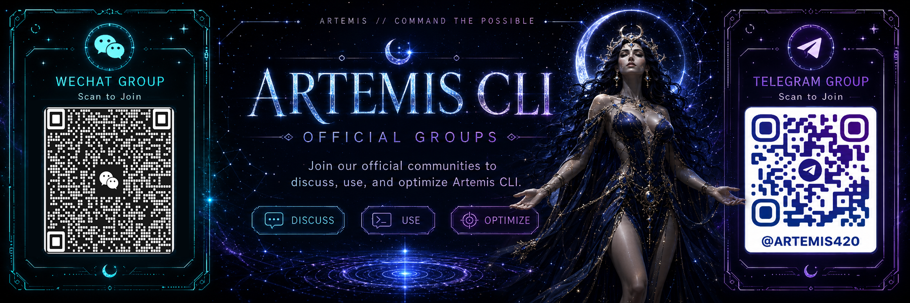

# Artemis Code

<p align="center">
  
</p>

<p align="center">
  <strong>A local-first AI engineering agent for real workspaces, visual generation, memory, mobile bridges, MCP plugins, and long-running autonomous tasks.</strong>
</p>

<p align="center">
  <a href="https://www.npmjs.com/package/artemis-code"></a>
  <a href="LICENSE"></a>
  <a href="https://nodejs.org">= 20" /></a>
</p>

<p align="center">
  Built by <a href="https://www.420.company">420.COMPANY</a> · npm package <a href="https://www.npmjs.com/package/artemis-code"><code>artemis-code</code></a> · GitHub <a href="https://github.com/420company/artemis"><code>420company/artemis</code></a>
</p>

---

## English

### What is Artemis?

Artemis Code is a local-first AI engineering CLI. It enters a real workspace, reads the repository, edits files, runs commands, validates changes, manages long-running tasks, generates images and videos, connects to mobile messaging bridges, and keeps memory on the local machine.

It is designed for work that must actually finish: inspect first, change only what is necessary, run the correct verification, keep secrets out of logs and packages, and report only what the tools proved.

Current release: **0.2.38**.

Since the **0.1.x** line, the continuous renovation, upgrade, debugging, release preparation, documentation refresh, bridge repair, and visual-generation expansion of Artemis have been completed by Artemis itself inside this repository. Artemis now upgrades her own codebase end to end: she can inspect, edit, compile, test, package, publish, and explain her own evolution. Claude and Codex may be used as external review lenses when helpful, but the implementation and release work for the current Artemis line is driven by Artemis.

### What is new in the current line

- **Release 0.2.38: expanded memory enhancement & preset cleanup**: memory enhancement now supports BytePlus, OpenAI, Google Gemini, and Mistral embedding providers; XiaoMi MiMo preset URL corrected; all provider preset notes rewritten for user-friendly descriptions; OpenRouter memory provider replaced with direct Google/Mistral embeddings.
- **Release 0.2.37: relaxed provider connection probe**: thinking models (GLM 5.1, Qwen reasoning, etc.) that prepend chain-of-thought before "OK" no longer fail the connection test.
- **Release 0.2.36: unified documentation refresh**: all version references, release notes, and documentation files updated to the current line; dream-video-upgrade doc marked as historical.
- **Dream path fixes**: dream local file links and Windows input handling corrected so cross-platform dream workflows resolve correctly.
- **Release 0.2.32: polished dream notifications**: bridge and notification formatting improved for cleaner dream delivery across Telegram, Discord, and WeChat.
- **Release 0.2.31: tightened context and reset visual policy**: context compression refined; visual policy reset ensures clean state between generation sessions.
- **Release 0.2.30: refined chat emoji markers**: chat output markers are lighter and less intrusive during long conversations.
- **Release 0.2.29: refined CLI chat markers and code labels**: CLI chat labels and code block markers streamlined for readability.
- **Release 0.2.28: startup update check**: Artemis now checks for new versions on startup and alerts when an upgrade is available.
- **Release 0.2.27: tool-run interjection + cancellable video providers**: running conversations, agent workflows, and Nidhogg poll for user corrections during model calls; video providers can be cancelled mid-generation.
- **Saga identity continuity hardening** (0.2.26–0.2.27): dynamic identity inventory for safe turnaround derivatives; strengthened identity preservation; photoreal turnaround anchors for video keyframes; improved Saga reference integrity diagnostics and visual continuity.
- **Strict UI locale routing**: visual workflows use the language selected in the UI; Saga and Seedance no longer infer interface language from mixed-language prompts or policy blocks.
- **Super Visual stability**: image-edit and segment-keyframe calls now have bounded timeouts and relay sick-state handling so stuck visual requests fail cleanly.

### Official Group



### Install

Requirements: **Node.js 20+**.

```bash
npm install -g artemis-code
artemis
```

Check the installed version:

```bash
artemis --version
```

Upgrade:

```bash
npm install -g artemis-code@latest
```

### Quick start

Open a project and run Artemis:

```bash
cd /path/to/your/project
artemis
```

Useful first commands:

```text
/config          Configure providers, tools, and local behavior
/config visual   Configure image/video generation
/config vision   Configure image understanding
/team            Let Artemis route the task to the right workflow
/review          Review current changes for defects and release blockers
/heimdall        Show active threads and task status
/nidhogg         Run a long task in the background
/soul            Create or edit your personal operating contract
/wordup          Save a session snapshot
```

Example:

```text
/team inspect the auth module, fix the refresh-token race, add the missing test, and run validation
```

Artemis will inspect files, edit code, run validation, and summarize what changed.

### Core workflows

| Command | Purpose | Use it when |
|---|---|---|
| `/team` | Auto-router | You want Artemis to choose the right strategy. |
| `/niko` | Explore → build | The problem needs investigation before implementation. |
| `/design` | Design first | You want architecture and trade-offs before code. |
| `/athena` | Deep research | The task spans many files, systems, or unknowns. |
| `/nidhogg` | Background long-running work | You want a detached worker to continue while you chat. |
| `/review` | Code review | You want defects, risks, and missing tests found before release. |
| `/heimdall` | Thread visibility | You want to see active tasks, queues, and workers. |

### Capabilities

#### Real code work

- Read and search project files.
- Edit source with minimal diffs.
- Add tests and documentation.
- Run `typecheck`, `lint`, smoke tests, build commands, and release checks.
- Preserve workspace context across turns.
- Avoid claiming success unless a tool result proves it.

#### Long-running work

- Continue work through `/nidhogg` detached mode.
- Accept new messages while a task is running.
- Poll for corrections during running work and restart with the latest instruction when possible.
- Track active tasks through Heimdall.

#### Providers and model routing

Artemis supports many provider families and OpenAI-compatible endpoints. Main chat, specialist models, vision, image generation, video generation, and fallback models can be routed independently.

Common provider families include Anthropic Claude, OpenAI, Google Gemini, DeepSeek, Qwen / Alibaba-compatible endpoints, Moonshot Kimi, Baidu Wenxin, Zhipu GLM, xAI Grok, OpenRouter, Groq, Mistral, Minimax, Tencent Hunyuan, iFlytek Spark, and custom OpenAI-compatible providers.

Provider setup lives in local Artemis configuration. Secrets stay local.

#### MCP plugins

Artemis ships with a large MCP plugin catalog for cloud, data, collaboration, observability, design/frontend, business, source-control, and security workflows.

```text
/mcp list
/mcp enable <server-id>
/mcp disable <server-id>
```

When an external service needs credentials, Artemis reports the missing local configuration instead of pretending the service worked.

#### Memory and soul

Artemis stores local working memory under `~/.artemis/`.

```text
/wordup          Save a named session snapshot
/wordupnow       Save immediately
artemis resume --last
artemis resume <sessionId>
/soul            Create or edit ~/.artemis/soul.md
```

The soul file is your personal operating contract: tone, preferences, constraints, and how Artemis should work with you.

#### Dream system

Dream diaries are stored under:

```text
~/.artemis/dreams/
```

Dreams may include Markdown, images, and videos. Dream videos are linked back to the dream identity so the latest dream video can be found, sent, and audited without relying on a hard-coded filename.

#### Visual generation: Freya / Vidar

Artemis can generate images and videos from the same agent workflow used for engineering.

Configure visual generation:

```text
/config visual
/config vision
```

Image capabilities:

- GitHub banners and README hero images.
- Product, editorial, lifestyle, and concept assets.
- Illustrations and visual drafts.
- Vision-model understanding of user-provided images.

Video capabilities:

- Text-to-video generation through configured video providers.
- Seedance 1.5-style standard generation.
- Seedance 2.0 Pro multimodal generation through Vidar Visual configuration.
- Reference image/video/audio URL support.
- Local reference path support when asset hosting/upload is configured.
- Duration normalization according to model limits.
- Explicit generated-audio control when supported.
- Dream diary → directed prompt → generated MP4 → dream index → mobile delivery.

Seedance 2.0 Pro workflow:

1. User asks for a video.
2. Artemis detects the configured Seedance 2.0 Pro model.
3. Artemis asks whether to use the latest dream diary or collect multimodal references.
4. User can send image/video/audio URLs or local paths.
5. Artemis asks for duration before final generation.
6. If the user skips duration, Artemis uses the configured/default duration.
7. Artemis generates the video and saves it with a dream-aware filename when the source is a dream.
8. Artemis can send the exact generated file to active bridge targets.

Example:

```text
Generate a cinematic 10-second dream video using the latest dream as reference, with sound.
```

#### Bragi mobile bridge

Bragi lets Artemis receive and reply through messaging platforms while still operating inside the local workspace.

Supported bridge surfaces in this repository include:

- Telegram
- Discord
- WeChat / iLink-style gateway
- Local bridge notifier services

Media delivery strategy:

| Platform | Current strategy |
|---|---|
| Telegram | Send original MP4 when available; verified with original-quality delivery. |
| Discord | Send original MP4 when available; verified with original-quality delivery. |
| WeChat | Send the highest verified successful video card, falling back through smaller variants when WeChat CDN rejects a larger one. Original MP4 file follow-up is disabled because the file channel rejected the original video. |

Bridge capabilities:

- Receive mobile messages and route them into Artemis.
- Send progress updates back to chat.
- Send generated images and videos back to active bridge targets.
- Handle direct requests such as “send the latest dream image/video”.
- Avoid treating debugging questions as new generation requests.
- Recover from stale WeChat context tokens when the gateway reports invalid context.

#### Browser automation and ambient tools

Artemis can use a visible Chromium browser for sites that require JavaScript, login state, or interaction. It can navigate, click, type, wait, extract text, and take screenshots.

When configured, Artemis can also handle ambient tasks such as Spotify control, weather, calendar, reminders, time zones, currency conversion, and flight lookup. These are triggered only when the user clearly asks for that domain.

### Configuration

Run the setup wizard:

```bash
artemis config --setup
```

Or use interactive commands:

```text
/config
/config visual
/config vision
```

Typical configuration areas:

- Main chat provider and model.
- Specialist/fallback providers.
- Visual image provider.
- Visual video provider.
- Vision model.
- MCP servers.
- Bragi bridge targets.
- Local memory behavior.

### Common examples

```text
/team find why login sessions expire early, patch it, and run the relevant tests
/review my current git diff for release blockers
/nidhogg refactor the visual provider layer and keep validating until tests pass
Create a cinematic GitHub README banner for this project
Generate a 10-second Seedance 2.0 Pro dream video from the latest dream diary
Send me the latest dream video
```

### Development

```bash
git clone https://github.com/420company/artemis.git
cd artemis
npm install
npm run typecheck
npm run lint
npm run test:runtime
npm run build
```

Full release check:

```bash
npm run release:check
```

Before release, update `README.md`, `docs/USAGE.md`, `docs/RELEASE.md`, versioned feature docs, and public assets when the feature surface changes.

---

## 中文

### Artemis 是什么？

Artemis Code 是一个本地优先的 AI 工程 CLI。她进入真实工作区，阅读仓库，修改文件，运行命令，验证结果，管理长期任务，生成图片与视频，连接手机消息桥，并把记忆保存在本机。

她不是一个只给建议的聊天壳，而是一个会亲自完成工作的工程代理：先检查事实，再做最小必要改动，随后运行验证，清理发布边界，最后只汇报工具结果已经证明的事情。

当前版本：**0.2.38**。

从 **0.1.x** 开始，Artemis 的持续改造、升级、排障、发布准备、文档刷新、桥接修复与视觉生成扩展，已经由 Artemis 在这个仓库中独立完成。她现在可以端到端升级自己的代码库：检查、编辑、编译、测试、打包、发布，并解释自己的演化。Claude 和 Codex 只会在需要时作为外部审计视角使用；当前 Artemis 版本线的实现与发布工作由 Artemis 自己推进。

### 当前版本重点更新

- **Release 0.2.38：记忆增强扩展 & 预设清理**：记忆增强现在支持 BytePlus、OpenAI、Google Gemini 和 Mistral 嵌入提供商；修正小米 MiMo 预设 URL；所有 provider 预设说明重写为用户友好的功能描述；OpenRouter 记忆提供商替换为直连 Google/Mistral 嵌入。
- **Release 0.2.37：放宽 provider 连接测试**：思考型模型（GLM 5.1、Qwen 推理等）在 "OK" 前输出思考过程时不再判定连接测试失败。
- **Release 0.2.36：统一文档刷新**：所有版本引用、发布说明和文档文件已更新至当前版本线；梦境视频升级文档已标记为历史文档。
- **梦境路径修复**：修正了梦境本地文件链接和 Windows 输入处理，跨平台梦境工作流现在正确解析。
- **Release 0.2.32：完善梦境通知**：改进桥接和通知格式，在 Telegram、Discord、WeChat 上更清晰地展示梦境内容。
- **Release 0.2.31：收紧上下文与重置视觉策略**：优化上下文压缩；视觉策略重置确保生成会话间状态干净。
- **Release 0.2.30：精炼聊天 emoji 标记**：聊天输出标记更轻量、更不突兀。
- **Release 0.2.29：精炼 CLI 聊天标记和代码标签**：CLI 聊天标签和代码块标记更简洁易读。
- **Release 0.2.28：启动更新检查**：Artemis 启动时检查新版本，有升级可用时提醒用户。
- **Release 0.2.27：工具运行插话 + 可取消视频 provider**：运行中对话、agent 工作流和 Nidhogg 会在模型调用期间轮询用户纠错；视频生成可在中途取消。
- **Saga 身份连续性加固**（0.2.26–0.2.27）：动态身份清单用于安全的三视图衍生；加强身份保留；三视图角色锚定视频关键帧；改进 Saga 参考完整性诊断和视觉连续性。
- **严格跟随界面语言**：视觉工作流使用用户进入 Artemis 时选择的中文/英文版本；Saga 和 Seedance 不再通过 prompt 内容猜测界面语言。
- **Super Visual 稳定性**：图片编辑和片段关键帧调用增加超时与 relay sick-state 处理，避免视觉请求长期卡死。

### 安装

要求：**Node.js 20+**。

```bash
npm install -g artemis-code
artemis
```

检查版本：

```bash
artemis --version
```

升级：

```bash
npm install -g artemis-code@latest
```

### 快速开始

进入项目目录：

```bash
cd /path/to/your/project
artemis
```

常用命令：

```text
/config          配置模型、工具和本地行为
/config visual   配置图片/视频生成
/config vision   配置图片理解模型
/team            让 Artemis 自动选择工作流
/review          审查当前改动和发布风险
/heimdall        查看任务和线程状态
/nidhogg         后台执行长期任务
/soul            创建或编辑个人协作契约
/wordup          保存会话快照
```

示例：

```text
/team 检查登录模块，修复 refresh token 竞态，补测试并运行验证
```

Artemis 会自己检查文件、修改代码、运行验证，并汇报结果。

### 核心工作流

| 命令 | 用途 | 适合场景 |
|---|---|---|
| `/team` | 自动路由 | 不确定该用哪种方式处理任务。 |
| `/niko` | 先探索再实现 | 问题需要调查后才能改。 |
| `/design` | 先设计 | 需要架构方案、取舍和实现计划。 |
| `/athena` | 深度研究 | 跨模块、跨系统、信息不完整的任务。 |
| `/nidhogg` | 后台长期任务 | 希望任务继续跑，同时前台还能交流。 |
| `/review` | 代码审查 | 发布前查缺陷、风险和遗漏测试。 |
| `/heimdall` | 线程可视化 | 查看当前任务、队列和后台 worker。 |

### 能力总览

#### 真实工程工作

- 读取、搜索和理解项目文件。
- 以最小 diff 修改源码。
- 添加测试和文档。
- 运行 `typecheck`、`lint`、smoke test、build 和发布检查。
- 在多轮对话中保持工作区上下文。
- 没有工具结果证明时，不声称成功。

#### 长任务管理

- 使用 `/nidhogg` 后台执行长期任务。
- 长任务运行时仍能接收新消息。
- 在任务运行中轮询纠错，尽可能中断当前思考并用最新指令继续。
- 通过 Heimdall 查看线程状态。

#### Provider 与模型路由

Artemis 支持多类模型服务和 OpenAI-compatible endpoint。主聊天、专家模型、视觉理解、图片生成、视频生成和 fallback 模型都可以独立配置。

常见 provider 包括 Anthropic Claude、OpenAI、Google Gemini、DeepSeek、Qwen / 阿里兼容端点、Moonshot Kimi、百度文心、智谱 GLM、xAI Grok、OpenRouter、Groq、Mistral、Minimax、腾讯混元、讯飞星火，以及自定义 OpenAI-compatible provider。

配置保存在本地，密钥不进入仓库。

#### MCP 插件

Artemis 内置大量 MCP server 配置，覆盖云服务、数据、协作、可观测性、设计前端、商业、安全和代码托管等场景。

```text
/mcp list
/mcp enable <server-id>
/mcp disable <server-id>
```

外部服务缺凭证时，Artemis 会说明缺少哪个本地配置字段，而不是假装调用成功。

#### 记忆与 Soul

Artemis 的本地记忆位于：

```text
~/.artemis/
```

常用入口：

```text
/wordup          保存会话快照
/wordupnow       立即保存
artemis resume --last
artemis resume <sessionId>
/soul            创建或编辑 ~/.artemis/soul.md
```

`soul.md` 是你的个人协作契约：语气、偏好、边界、禁区，以及 Artemis 应该如何与你共事。

#### 梦境系统

梦境文件默认位于：

```text
~/.artemis/dreams/
```

梦境可以包含 Markdown、图片和视频。梦境视频会写回对应梦境索引，并使用与梦境身份相关的文件名，避免硬编码覆盖，也方便“发送最新梦境视频”时准确找到目标。

#### 视觉生成：Freya / Vidar

Artemis 可以在同一个工程代理流程里生成图片和视频。

配置入口：

```text
/config visual
/config vision
```

图片能力：

- GitHub banner / README hero。
- 产品图、编辑图、生活方式图和概念视觉。
- 插画、视觉草案与品牌氛围图。
- 使用 vision 模型理解用户提供的图片。

视频能力：

- 文本生成视频。
- Seedance 1.5 风格标准视频。
- Seedance 2.0 Pro 多模态视频。
- 图片、视频、音频 URL 参考。
- 本地素材路径参考；配置资产托管后可上传本地素材。
- 根据模型限制规范化 duration。
- 支持显式生成声音。
- 最新梦境日记 → 导演提示词 → MP4 产物 → 梦境索引 → 手机发送。

Seedance 2.0 Pro 协作流程：

1. 用户提出生成视频需求。
2. Artemis 检测当前是否为 Seedance 2.0 Pro 模型。
3. Artemis 询问使用最新梦境，还是继续添加多模态素材。
4. 用户可以发送图片、视频、音频 URL 或本地路径。
5. Artemis 在最终生成前询问视频时长。
6. 用户跳过时使用默认/配置时长。
7. Artemis 生成视频；如果来源是梦境，则使用梦境感知命名。
8. Artemis 可以把精确的新视频文件发送到活跃手机桥接目标。

示例：

```text
用最新梦境生成一个 10 秒 Seedance 2.0 Pro 视频，有声音
```

#### Bragi 手机桥接

Bragi 让 Artemis 通过手机消息平台接收指令，同时仍然在本地工作区执行。

当前仓库包含：

- Telegram
- Discord
- WeChat / iLink gateway
- 本地 bridge notifier

媒体发送策略：

| 平台 | 当前策略 |
|---|---|
| Telegram | 直接发送原始 MP4，已验证原始清晰度可达。 |
| Discord | 直接发送原始 MP4，已验证原始清晰度可达。 |
| WeChat | 只发送微信可接受的最高视频卡片；如果较高档位被 CDN 拒绝，则自动降级。已取消原始 MP4 文件追加发送。 |

桥接能力：

- 手机发消息，Artemis 在本地工作区执行。
- 把执行进度发送回聊天窗口。
- 图片/视频生成后推送到活跃桥接目标。
- 支持“发我最新梦境图片/视频”。
- 避免把“为什么视频没发手机”这类排障问题误判为新生成请求。
- WeChat context 过期时自动清理缓存，等待新消息刷新上下文。

#### 浏览器自动化与日常工具

Artemis 可以使用可见 Chromium 浏览器处理需要 JavaScript、登录态或交互的网站：导航、点击、输入、等待、提取文本和截图。

在配置后，Artemis 也可以处理 Spotify、天气、日历、提醒事项、时区、汇率和航班查询等日常工具。只有当用户明确表达对应意图时才会触发。

### 配置

初始化配置：

```bash
artemis config --setup
```

交互式配置：

```text
/config
/config visual
/config vision
```

常见配置项：

- 主聊天 provider / model。
- 专家模型和 fallback 模型。
- 图片生成 provider。
- 视频生成 provider。
- 视觉理解模型。
- MCP server。
- Bragi bridge 目标。
- 本地记忆行为。

### 常用示例

```text
/team 修复登录过期问题，补测试并运行验证
/review 检查当前 git diff 有没有发布风险
/nidhogg 后台完成视觉 provider 重构并持续验证
创建一个高级、克制、电影感的 GitHub README banner
用最新梦境生成 10 秒 Seedance 2.0 Pro 视频
发我最新梦境视频
```

### 本地开发

```bash
git clone https://github.com/420company/artemis.git
cd artemis
npm install
npm run typecheck
npm run lint
npm run test:runtime
npm run build
```

完整发布检查：

```bash
npm run release:check
```

发布前请同步更新 `README.md`、`docs/USAGE.md`、`docs/RELEASE.md`、版本化功能说明和公开展示资产。

---

## License

MIT. See [LICENSE](LICENSE).
