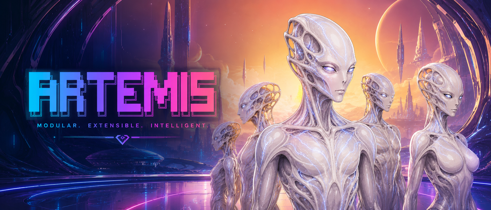

# Artemis Code

<p align="center">
  
</p>

<p align="center">
  <strong>Local-first AI engineering, visual generation, long-video production, memory, tools, and mobile automation — in one command-line workspace.</strong>
</p>

<p align="center">
  <a href="https://www.npmjs.com/package/artemis-code"></a>
  <a href="LICENSE"></a>
  <a href="https://nodejs.org">= 20" /></a>
</p>

<p align="center">
  Created by <a href="https://www.420.company">420.COMPANY</a> · npm: <a href="https://www.npmjs.com/package/artemis-code"><code>artemis-code</code></a> · GitHub: <a href="https://github.com/420company/artemis"><code>420company/artemis</code></a>
</p>

---

## English

### What is Artemis Code?

Artemis Code is a local-first AI workspace agent for people who want execution, not suggestions.

It works inside your real project folder, reads the files, edits the code, runs commands, checks logs, verifies results, and keeps context across long sessions. It can build software, review changes, manage tools, generate images and video, operate long creative workflows, remember your preferences, and connect to mobile chat platforms so you can drive work from anywhere.

Artemis is designed for users who want one intelligent operator across engineering, creative production, research, automation, and daily workflows.

Current npm release: **0.2.80**

---

### Core experience

#### 1. Local-first autonomous execution

Artemis runs where your work lives: your terminal, your repository, your files, your machine.

You can ask for a feature, a fix, a release check, a refactor, a README rewrite, a visual asset, or a long video. Artemis will inspect the workspace, plan the steps, make the changes, run the appropriate checks, and report the result with evidence.

What this means in practice:

- Reads and edits real local files
- Uses precise patches instead of vague instructions
- Runs terminal commands directly
- Diagnoses build, lint, test, and runtime failures
- Keeps changes small when the task is small
- Runs verification before claiming success
- Works with existing project conventions instead of imposing a template

#### 2. Software engineering workflow

Artemis can handle everyday and advanced engineering work:

- Implement new features
- Fix bugs from stack traces or screenshots
- Refactor modules safely
- Update configuration files
- Add or adjust tests
- Review Git diffs before release
- Prepare npm package releases
- Inspect package contents before publishing
- Clean temporary files and accidental artifacts
- Diagnose environment, dependency, and command failures

The goal is simple: you describe the outcome; Artemis does the operational work.

##### Automatic workflow routing

You never pick a workflow by name. For each request Artemis decides how much process the task needs:

- **Direct** (default) — chat, quick questions and clear, small tasks run on the normal single-agent tool loop.
- **Deep planning** — non-trivial engineering (investigations, migrations, refactors) is investigated and planned before editing, then verified.
- **Parallel team** — large multi-part builds or repo-wide changes are split into independent parts, with at most 4 sub-agents per run.
- **Compare** — when you ask Artemis to produce several candidate solutions and pick the best ("give me three approaches and implement the best one"), up to 3 candidates are weighed in one critique round; the winner is built only if you asked for an implementation. Questions such as "which is better" or "list some alternatives" are answered directly.
- **Design** — website and UI builds follow the `design-workflow` skill: visual system, real assets, desktop and mobile screenshot checks.
- **Saga** — for a clear request for a new long, multi-segment video, Artemis first asks whether to use the Saga long-video workflow (it costs money) and starts only after you answer yes; `/saga` starts it at once.

Cheap heuristics decide the clear cases; questions, follow-ups and writing tasks always take the direct path. Only a long request that matches nothing clearly gets one small classification call, and only when a worker model is configured (low effort, strict JSON, 8-second timeout); any doubt or error falls back to the direct path. Routed workflows never raise the model's effort setting. Every run has a hard sub-agent budget, and Artemis can switch itself to a heavier workflow mid-task with its `use_workflow` tool. The old `/niko`, `/athena`, `/contest`, `/design` and `/team` commands are gone: if you type one, the word is dropped and the rest is routed like any other request (it never forces a workflow).

#### 3. Persistent memory and long-context stability

Long work often fails because the assistant forgets. Artemis is built to preserve continuity.

It maintains local memory, session state, compacted history with a full archive, tool evidence, and recovery context so long tasks can continue without losing the important parts. Your preferences, project conventions, workflow habits, and recurring constraints can become part of the way Artemis works with you.

Useful for:

- Large refactors
- Multi-step releases
- Long creative workflows
- Repeated project maintenance
- Returning to a task after interruption
- Keeping your personal style and rules consistent

##### How context compaction works

Every conversation (web sessions, chat bridges, the CLI) goes through the same context manager (`src/core/compaction`):

- **Budget.** The limit is the model's context window minus the reply reserve and a safety margin. Before each request, Artemis measures the context: the provider-reported size of the last request (cache reads and writes included) plus an estimate of what was added since. The estimate counts one token per Chinese/Japanese/Korean character.
- **Large tool output** is written to `sessions/<id>/tool-results/`. The history keeps a preview of the head and tail with the file path, and newlines are never removed.
- **At about 78% of the budget**, old tool results outside the recent part of the conversation become one-line placeholders that name the tool, its arguments, the size and the file to re-read. If that is not enough, everything before the most recent ~25% is summarized by the worker model (or the main model), in the conversation's language. The summary has eight sections: goals and latest instructions, decisions, files, facts and errors, preferences, completed work, pending tasks, and things to remember. The stored history becomes a "[Context compacted]" message plus the recent messages. Removed messages are appended to `sessions/<id>/transcript.jsonl`, which the agent can read. The request you are working on is never lost: when it leaves the recent part, the compacted message keeps it word for word as an earlier request (a very long one is shortened in the middle, with a note), and while that same run is still going each request to the model also says it is the current task. A later run sees it only as history.
- **Rolling summaries.** The next compaction folds only the new messages into the previous summary. After compacting, Artemis re-attaches the task board, fresh copies of the files being worked on, and the in-flight action. Only files the agent itself read or wrote successfully are re-attached, and only if they are inside the workspace, not sensitive (keys, `.env` and similar), and allowed by the permission settings. If the summarizer fails, a mechanical summary that always fits is used instead. A very old, very long history is not sent whole: its recent part is summarized, and the older part becomes a list of your messages, one short line each. If even that is too long, the list keeps your earliest and latest messages, samples the ones in between, and says so. After 3 failures in a row the summarizer pauses, and it is tried again after 2 compactions or 30 minutes. A cancelled run does not count as a failure.
- **Untrusted content.** The summarizer is told that tool and web output is data, not instructions, and that goals come only from your messages. The summary goes back into the conversation wrapped in `<conversation_summary>` tags, marked as data.
- **Full history.** `artemis session show <id>` prints the conversation as a chat shows it: your messages and the agent's replies, in order, including the ones archived in `transcript.jsonl`, without tool messages, the compaction marker or per-run context. It returns the latest 500 by default; `history.hasMore` and `history.nextBefore` page back with `--before <id>` (and `--limit N`). `--full` prints every message with tool output (for debugging), and `--live` prints the stored record as it is. Showing a session never changes any file. `artemis session delete <id>` also removes the session's context files and its sub-agent sessions.
- **Files and locking.** Session files are written to a temporary file and renamed into place, so a reader never sees half a file. Context files are readable only by you (files 0600, folders 0700). Each session's `tool-results/` folder is capped at 200MB: the oldest files the conversation no longer points to go first, and files it still points to are kept even over the cap. The CLI keeps them under `~/.artemis/context/`. Only one process runs a session at a time; a second one waits up to 30 seconds (`ARTEMIS_SESSION_LOCK_TIMEOUT_MS`), then `artemis execute` exits with code **75** and prints `CLI Error: This conversation is busy with another task; try again in a moment.` A lock whose process stopped refreshing it for a minute is taken over. If a session file still cannot be read after a few retries, it is moved aside to `<id>.json.corrupt-<time>` and the session starts fresh.
- **Overflow recovery.** If the provider still rejects a request as too long, Artemis compacts harder, retries once, and saves the result, so a chat bridge never repeats the same overflow.
- **Prompt caching.** The system prompt and the stored history stay byte-identical between requests and runs. Per-request context (recalled memories, activated skills, evidence) goes in a message after the conversation and is never saved, so the cached prefix is reused.
- **Cost cap.** Hosted runs (`artemis execute`, web sessions, chat bridges) cap the context at **200K tokens** by default, so a 1M-window model compacts at about 78% of 200K instead of about 78% of 1M. The interactive CLI uses the full window. To change the cap, set `setup.agent.compression.maxContextTokens` (this wins) or the `ARTEMIS_MAX_CONTEXT_TOKENS` environment variable (for the server or provisioning). Either one also applies to the CLI. `0` or `off` removes the cap.
- **Output reserve.** The budget reserves the model's output limit (the platform `maxOutputTokens` when set), up to a quarter of the window, plus a 5% margin. A request that fits the budget therefore always leaves the adapters room to send that `max_tokens` unchanged.
- **Settings** (`setup.agent.compression`): `enabled: false` turns off proactive compaction (overflow recovery stays on), `threshold` changes the 78% trigger, and `maxContextTokens` sets the cap described above.

#### 4. Visual generation system

Artemis includes a full visual workflow layer for image and video generation.

It can help create:

- Product visuals
- Concept art
- Character references
- README and brand assets
- UI and presentation images
- Short video clips
- Long cinematic sequences
- Abstract visuals and VJ loops
- Story-driven video scenes

The visual system is provider-aware and can route image, vision, and video requests through configured providers. It asks for missing inputs, handles local media references, and keeps creative intent connected to the final generation workflow.

#### 5. Saga long-video engine

Saga is Artemis' long-video production workflow. It is built for videos that need structure, consistency, and continuity instead of one-off clips.

Saga can:

- Turn a concept into a structured video brief
- Expand sparse ideas into a complete cinematic script
- Respect user-written scripts as authoritative material
- Split long videos into model-safe segments
- Preserve character identity, wardrobe, accessories, scene logic, lighting, and movement direction
- Use reference images, direct image inputs, character photos, or turnaround sheets
- Ask for aspect ratio, subtitle mode, duration, references, and BGM choices
- Generate original-audio, full-BGM, and dialogue-ducked variants when soundtrack mixing is used
- Support clean-direct / raw-look workflows
- Handle pure environment or abstract videos without forcing unwanted characters
- Maintain opening framing, movement direction, and continuity between shots

Saga is designed for users who want to say: “Make this into a real video,” then be guided through the right creative and technical steps.

#### 6. Brief authoring and AI screenwriter mode

Artemis can work with both complete scripts and partial inspiration.

If you already have a script, Artemis treats it as the controlling narrative. If you only have a topic, mood, character, place, or rough idea, Artemis can act as a screenwriter and expand it into a structured Saga-compatible brief.

The package includes a full bilingual authoring guide:

- `docs/saga-brief-authoring-guide.html`

It explains how to write timecoded scenes, dialogue markers, aspect ratio notes, character locks, opening framing, world anchors, audio intent, BGM planning, and advanced long-video brief structures.

#### 7. Mobile bridge and ambient control

Artemis can be connected to chat platforms such as Telegram, Discord, or WeChat through its bridge system.

This lets you:

- Send work instructions from your phone
- Start visual or video workflows remotely
- Receive generated media back in chat
- Continue project work away from the desk
- Use Artemis as an always-available ambient agent

The mobile bridge turns your local machine into a reachable creative and engineering workstation.

#### 8. Daily tools and external integrations

Artemis is not limited to code. It includes workflow tools for everyday operations and can connect to external services through MCP servers.

Capabilities include:

- Weather, time, currency, and flight lookups
- Calendar and reminder workflows on macOS
- Spotify playback control when explicitly requested
- Browser automation for pages that require interaction
- MCP server discovery, enabling, and runtime use
- Local speech, media, and bridge utilities

The intention is to make Artemis useful as a practical daily operator, not only a coding assistant.

#### 9. Background work and heavy tasks

For long-running work, Artemis can detach tasks into background workflows. This is useful for large investigations, deep refactors, extended research, or slow media operations.

You can keep using your terminal while Artemis continues the heavy work and returns when there is a result.

---

### Installation

Requirements:

- Node.js **20+**
- npm
- A terminal
- At least one configured AI provider for model-backed tasks

Install globally:

```bash
npm install -g artemis-code
```

Start Artemis inside any project:

```bash
cd /path/to/your/project
artemis
```

---

### Typical ways to use Artemis

```text
Fix the failing build and run the tests.
```

```text
Review my current Git diff for release blockers.
```

```text
Create a polished product image for this landing page.
```

```text
Turn this story idea into a 60-second cinematic Saga video.
```

```text
Clean the package, verify it, bump the version, and publish to npm.
```

```text
Rewrite the README for GitHub so it explains the product clearly to users.
```

---

### Useful commands

- `/config` — Configure providers, models, keys, and preferences
- `/saga` — Start the Saga long-video wizard right away (for a clear long-video request Artemis also offers it)
- `/review` — Review the current Git diff and identify risks
- `/nidhogg` — Run heavy or long work in the background
- `/wordup` — Save important context into memory
- `/soul` — Define long-term personal style, rules, and working preferences
- `/mcp` — Manage external MCP integrations

---

### Platform model capabilities and the vision helper

Model names behind a gateway can be aliases (`gpt-6-sol` may be a text-only GLM model), so Artemis does not have to guess from the name. A provider profile in `~/.artemis/providers.json` can carry the real values:

```json
{
  "defaultMainProfileId": "platform-main",
  "visionProfileId": "artemis-platform-vision",
  "profiles": [
    { "id": "platform-main", "model": "gpt-6-sol", "supportsImages": false,
      "contextLength": 200000, "maxOutputTokens": 16384, "capabilitiesSource": "platform" },
    { "id": "artemis-platform-vision", "model": "vision-model", "supportsImages": true, "managedBy": "platform" }
  ]
}
```

- `supportsImages` always beats name inference, with or without `capabilitiesSource`. With `"capabilitiesSource": "platform"`, `contextLength` and `maxOutputTokens` also win over every name rule (including the GPT-5.6 / GPT-6 272K cap and `/models` metadata) in the HUD, compaction, `execute`, bridges, workflows and sub-agents, and Artemis never caps or re-detects that profile. A field left out falls back to the usual rules.
- `max_tokens` is kept within the window: min(output limit, window − estimated prompt − margin). When the window is only guessed from the model name, it never drops below max(1024, 25% of the limit). Platform profiles always send plain `max_tokens`.
- Fields Artemis does not know, such as `managedBy`, are kept when it rewrites `providers.json`. A bridge re-reads its provider when `providers.json` changes.
- `visionProfileId` (stored like `specialistProfileId`, project store first, then `~/.artemis`) names a profile that can see images. When the main model cannot, images attached with `--image`, uploaded on the web or sent through a chat bridge are described once by that model (all visible text transcribed, charts and tables as data, in the user's language), and the main model gets the text as "[Image N description by vision helper — …]". `view_image` returns the same kind of description. Each description is wrapped in an `<image_description>` block after a note that it is data from an image, never instructions, and text inside the image cannot close that block. Helper calls time out after 60 s and follow the run's cancellation; a failed, timed-out or cut-off image gets a "could not be read" note instead. Descriptions are cached per run by image content and the user's question. A platform-managed global vision profile (`managedBy: "platform"`) wins over a workspace store; otherwise a workspace store is trusted like it is for the main profile.
- With no vision helper and a text-only model, attached images are not an error: the model is told the plan cannot read images and continues with the text.

### Web search backends and hosted platform search

`search_web` tries its backends in order and moves on when one fails or finds nothing:

| Backend | Needs | Notes |
|---|---|---|
| `platform` | a hosted agent (see below) | The platform gateway's `POST /v1/search`, billed to the owner's platform account. Tried first on a platform-managed host when you configured no search key of your own. |
| `duckduckgo` | nothing | HTML scraping; often blocked from datacenter IPs. |
| `bing` | `BING_API_KEY` | |
| `google` | `GOOGLE_API_KEY` + `GOOGLE_CX` | |
| `wikipedia` | nothing | Encyclopedic results only. |

A Bing or Google key of your own keeps today's order (the platform is not used). `backend: "platform"` asks for it by name; `freshness: "day" | "week" | "month" | "year"` limits results to recent pages (platform backend). On a hosted VPS the agent server writes the platform settings into the global `providers.json` (a workspace store cannot redirect them):

```json
"webSearch": { "provider": "platform", "enabled": true, "baseUrl": "https://<gateway>/v1",
               "apiKey": "<platform key>", "managedBy": "platform" }
```

`"enabled": false` turns it off. Without a `webSearch` entry, a main profile marked `capabilitiesSource` or `managedBy` `"platform"` is used as the gateway, with its own base URL and key. A refused or failed platform search (balance too low, rate limited, not offered, every provider down, gateway unreachable) is reported in the tool result as it is; when a fallback backend then answers, the result starts with a note saying so. A platform search that found nothing is "No results found.", not a failure. Results reach the model under a header marking them as untrusted web content (data, never instructions), each title and snippet flattened to one line. Nothing is ever made up.

### Long headless runs

`artemis execute` runs slow tools (Saga long video, video generation, delegated work) in the foreground, so their result is part of the reply. While a foreground tool runs, it prints `[tool:<name>] progress {"elapsedSeconds":N}` to stderr every minute (`ARTEMIS_TOOL_HEARTBEAT_MS`, at least 1000), so a host that stops runs that make no progress can tell a long tool from a hung engine. The line stands for progress, not just a live process: once a tool has run longer than it is expected to (`generate_long_video` 4 hours, `generate_video` and `deep_research` an hour, `run_command` its own timeout plus a minute, most tools 10 minutes), it prints one line with `"overdue":true` and goes quiet, so the host can stop a hung tool long before its hard limit. The interactive CLI and chat bridges do not print it.

---

### Who Artemis is for

Artemis is for builders, founders, creators, designers, engineers, and operators who want a single local agent that can actually do the work.

Use it when you want:

- Less copy-paste
- Fewer manual terminal steps
- Stronger release discipline
- Better continuity across long tasks
- A serious visual and video workflow
- A local agent that understands your workspace
- A mobile-accessible assistant that can operate your machine

---

## 中文

### Artemis Code 是什么？

Artemis Code 是一个本地优先的 AI 工作区代理。它不是只给建议、让你自己复制粘贴的聊天框，而是可以直接进入你的真实项目目录，读取文件、修改代码、执行命令、检查日志、验证结果，并在长任务中保持上下文连续的执行型助手。

它可以写代码、修 Bug、做发布检查、清理包内容、生成图片和视频、组织长视频工作流、记住你的偏好，也可以通过手机聊天平台远程接收指令和发送产物。

Artemis 面向的是希望把工程、创意、自动化、研究和日常操作交给一个统一智能操作者的人。

当前 npm 版本：**0.2.80**

---

### 核心体验

#### 1. 本地优先，直接执行

Artemis 运行在你的终端和项目目录里。它面对的不是抽象问题，而是真实文件、真实命令、真实构建、真实错误。

你可以让它做一个功能、修一个问题、检查一次发布、重写文档、生成视觉素材，或者制作一段长视频。Artemis 会自己检查工作区、拆解步骤、修改文件、运行验证，并基于工具结果汇报进展。

实际效果是：

- 直接读取和编辑本地文件
- 用精确 Diff 修改，而不是给你一段需要手抄的代码
- 直接执行终端命令
- 自动诊断构建、lint、测试和运行时报错
- 小任务做最小改动，大任务分阶段推进
- 验证通过后再汇报完成
- 尊重现有项目风格，不强行套模板

#### 2. 工程开发工作流

Artemis 可以处理日常和复杂的软件工程任务：

- 实现新功能
- 根据报错、日志或截图修 Bug
- 安全重构模块
- 更新配置文件
- 补充或修正测试
- 发布前审查 Git diff
- 准备 npm 包发布
- 检查 npm 包实际包含内容
- 清理临时文件、日志和意外产物
- 排查环境、依赖和命令失败

你描述目标，Artemis 负责执行过程。

##### 自动选择工作流

不需要记任何工作流名字。每条请求 Artemis 都会根据任务和复杂度决定用多重的流程：

- **直接处理**（默认）——闲聊、简单提问和明确的小任务，走普通的单 agent 工具循环。
- **深度规划**——有一定复杂度的工程任务（排查、迁移、重构）先调查、定方案，再实现并验证。
- **并行分工**——大型多模块项目或全仓改动拆成独立部分并行处理，每次最多 4 个子代理。
- **多方案对比**——只有当你明确要求产出多个方案并选出最优（"给我三个方案并选最好的实现"）时才启用：最多 3 个候选、只评审一轮；只有你要求实现时才实现胜出方案。"哪个好""列几个备选"这类问题直接回答。
- **设计**——网站和界面类任务按 `design-workflow` 技能执行：视觉系统、真实素材、桌面和手机截图验收。
- **Saga 长视频**——明确要求制作一段新的多段长视频时，Artemis 会先问你是否使用 Saga 长视频工作流（会产生费用），你确认后才开始；`/saga` 则直接进入。

明确的情况由轻量规则直接判断；提问、追问和写作类任务一律直接处理。只有很长又看不出类型的请求，并且配置了 worker 模型时，才会做一次小的分类调用（低 effort、严格 JSON、8 秒超时），任何不确定或出错都回到直接处理。自动选择的工作流不会提高模型的 effort。每次运行都有子代理数量上限，Artemis 在任务中途发现更复杂时，也可以用 `use_workflow` 工具自己升级流程。原来的 `/niko`、`/athena`、`/contest`、`/design`、`/team` 命令已移除：如果仍然输入，斜杠词会被忽略，其余内容按普通请求路由（不会强制进入任何工作流）。

#### 3. 持久记忆与长上下文稳定性

很多 AI 工具在长任务中会遗忘前文。Artemis 的设计目标是让任务可以持续推进。

它会把记忆、会话状态、压缩后的历史与完整归档、工具证据和恢复上下文保存在本地，让长时间工作不会因为中断、折叠或会话变长而失去关键线索。你的偏好、项目规则、语言风格和长期约束也可以被保留下来。

适合用于：

- 大型重构
- 多阶段发布
- 长视频和视觉制作
- 长期项目维护
- 中断后继续任务
- 保持个人工作习惯和审美一致

##### 上下文压缩是怎么工作的

网页会话、聊天桥接和命令行都使用同一个上下文管理器（`src/core/compaction`）：

- **预算**：上限是模型的上下文窗口，减去回复预留和安全余量。每次请求前，Artemis 用上一次请求由服务商报告的实际大小（包含缓存读写），加上之后新增内容的估算，来衡量当前上下文。估算时每个中日韩字符按 1 个 token 计。
- **大的工具输出**会写入 `sessions/<id>/tool-results/`。历史中只保留开头和结尾的预览，以及文件路径；换行永远不会被删除。
- **达到预算的约 78% 时**，最近对话之外的旧工具结果会被替换成一行占位符，写明工具、参数、大小和可以重新读取的文件。如果仍然不够，最近约 25% 之前的全部内容会由副模型（没有则用主模型）按对话所用的语言总结。摘要分为八个小节：目标与最新指令、决策、文件、事实与错误、偏好、已完成工作、待办和需要记住的事项。保存的历史变为一条「[上下文已压缩]」消息加上最近的消息。被移除的消息会追加到 `sessions/<id>/transcript.jsonl`，代理可以读取它。正在处理的请求不会丢失：它离开最近的部分后，压缩消息会把它作为之前的请求逐字保留（特别长的会从中间截短，并附说明）；同一次运行还在进行时，每次发给模型的请求都会说明这就是当前任务。之后的运行只把它当作历史。
- **滚动摘要**：下一次压缩只把新消息合并进上一次的摘要。压缩后，Artemis 会重新附上任务清单、正在处理的文件的最新内容和进行中的动作。只会重新附上代理自己成功读取或写入过的文件，而且这些文件必须在工作区内、不是敏感文件（密钥、`.env` 等），并且权限设置允许读取。摘要模型失败时，改用一定能放进窗口的机械摘要。很早、很长的历史不会整段发送：较近的部分交给摘要模型，较早的部分变成你的消息列表，每条一行短句。如果这样仍然太长，列表会保留最早和最近的消息，中间的均匀抽取，并注明这一点。连续失败 3 次后摘要模型会暂停，在 2 次压缩或 30 分钟后再试。被取消的运行不算失败。
- **不可信内容**：摘要模型会被告知，工具和网页输出只是数据而不是指令，目标只来自你的消息。摘要放回对话时包在 `<conversation_summary>` 标签里，并标明是数据。
- **完整历史**：`artemis session show <id>` 按聊天界面的样子输出对话：你的消息和代理的回复，按顺序排列，包括归档在 `transcript.jsonl` 中的部分，不包括工具消息、压缩标记和每次运行的上下文。默认返回最近 500 条；用 `history.hasMore` 和 `history.nextBefore` 配合 `--before <id>`（以及 `--limit N`）向前翻页。`--full` 输出包含工具输出的全部消息（用于调试），`--live` 原样输出保存的记录。查看会话不会修改任何文件。`artemis session delete <id>` 会同时删除该会话的上下文文件和它的子代理会话。
- **文件与加锁**：会话文件先写入临时文件再改名替换，读取方不会读到写了一半的文件。上下文文件只有你自己可以读取（文件 0600，目录 0700）。每个会话的 `tool-results/` 目录上限为 200MB：先删除对话已不再引用的最旧文件，仍被引用的文件即使超出上限也会保留。命令行把它们放在 `~/.artemis/context/` 下。同一个会话同一时间只由一个进程运行，第二个进程最多等待 30 秒（`ARTEMIS_SESSION_LOCK_TIMEOUT_MS`），之后 `artemis execute` 以退出码 **75** 结束，并输出 `CLI Error: 这个对话正在处理另一个任务，请稍后再试。`持有锁的进程一分钟没有刷新时，锁会被接管。会话文件重试几次后仍无法读取时，会被移到 `<id>.json.corrupt-<时间>`，会话重新开始。
- **超窗恢复**：如果服务商仍然因为过长拒绝请求，Artemis 会更大力度地压缩、重试一次并保存结果，聊天桥接不会反复撞上同一个超窗错误。
- **提示缓存**：系统提示和保存的历史在各次请求、各次运行之间保持字节完全一致。每次请求相关的上下文（召回的记忆、激活的技能、证据）放在对话之后的一条消息里，并且不会保存，因此缓存的前缀可以复用。
- **成本上限**：托管运行（`artemis execute`、网页会话、聊天桥接）默认把上下文限制在 **200K tokens**，因此 1M 窗口的模型在 200K 的约 78% 处压缩，而不是 1M 的约 78%。交互式命令行使用完整窗口。要修改上限，可设置 `setup.agent.compression.maxContextTokens`（优先）或环境变量 `ARTEMIS_MAX_CONTEXT_TOKENS`（供服务器或部署配置使用），两者同样作用于命令行。设为 `0` 或 `off` 表示不设上限。
- **输出预留**：预算会为模型的输出上限（设置了平台 `maxOutputTokens` 时以它为准）预留空间，最多占窗口的四分之一，另加 5% 余量。因此只要请求在预算内，适配器总能按原值发送这个 `max_tokens`。
- **设置**（`setup.agent.compression`）：`enabled: false` 关闭主动压缩（超窗恢复仍然生效），`threshold` 调整 78% 的触发点，`maxContextTokens` 设置上面所说的上限。

#### 4. 视觉生成系统

Artemis 内置完整的视觉工作流，可以处理图片、视觉分析和视频生成。

它可以帮助你创建：

- 产品图
- 概念视觉
- 角色参考
- README 与品牌素材
- UI 和展示图片
- 短视频片段
- 长视频序列
- 抽象视觉和 VJ 循环
- 有剧情结构的视频场景

视觉系统会根据配置的模型和供应商选择合适路径，主动询问缺失参数，识别本地媒体引用，并把创意意图稳定传递到最终生成流程。

#### 5. Saga 长视频引擎

Saga 是 Artemis 的长视频生产工作流。它不是简单生成一个短片段，而是为需要结构、连续性和可控性的完整视频而设计。

Saga 可以：

- 把概念整理成结构化视频 brief
- 把零散灵感扩展成完整影视脚本
- 尊重用户已经写好的剧本，不随意替换剧情
- 把长视频拆成当前模型稳定支持的片段
- 保持角色身份、服装、配饰、场景逻辑、光线和运动方向一致
- 支持参考图、直接图片输入、角色照片和三视图
- 主动询问画幅比例、字幕模式、总时长、参考素材和 BGM 选择
- 使用 BGM 时自动输出原声版、完整混音版和对白智能避让版
- 支持 clean-direct / raw-look 原始质感模式
- 支持纯环境、抽象视觉和无人物视频
- 稳定控制首帧定位、人物朝向、运动方向和镜头连续性

Saga 适合用户直接说：“把这个想法做成一条真正的视频。”然后由 Artemis 引导完成创作和技术流程。

#### 6. 剧本说明书与 AI 编剧模式

Artemis 可以处理完整剧本，也可以处理只有一句话的灵感。

如果你已经有剧本，Artemis 会把它作为权威叙事来执行。如果你只有主题、氛围、人物、地点或大致想法，Artemis 可以进入 AI 编剧模式，把它扩展成 Saga 能稳定识别的结构化 brief。

包内包含完整中英文说明书：

- `docs/saga-brief-authoring-guide.html`

它详细说明了时间码、对白标记、画幅比例、角色锁定、首帧定位、世界锚点、音频意图、BGM 规划和高级长视频 brief 写法。

#### 7. 手机桥接与远程控制

Artemis 可以通过桥接系统连接 Telegram、Discord 或微信等聊天平台。

你可以：

- 在手机上发送工作指令
- 远程启动视觉或视频流程
- 在聊天窗口接收生成好的图片和视频
- 离开电脑后继续推进项目
- 把本地机器变成可远程调用的创意和工程工作站

这让 Artemis 不只是终端工具，也可以成为随时可用的 ambient agent。

#### 8. 日常工具与外部集成

Artemis 不只处理代码。它也可以接入日常工具和外部服务。

能力包括：

- 天气、时间、汇率、航班查询
- macOS 日历和提醒事项
- 明确要求时控制 Spotify 播放
- 使用浏览器自动化处理需要交互的网页
- MCP 服务发现、启用和调用
- 本地语音、媒体和桥接工具

目标是让 Artemis 成为一个实用的日常操作者，而不仅仅是编程助手。

#### 9. 后台任务与重型工作

对于耗时任务，Artemis 可以把工作转入后台执行。适合大型排查、深度重构、长时间研究和媒体处理。

你可以继续使用终端，Artemis 在后台推进任务，并在有结果后回来汇报。

---

### 安装

环境要求：

- Node.js **20+**
- npm
- 终端
- 至少配置一个可用的 AI 模型供应商

全局安装：

```bash
npm install -g artemis-code
```

进入任意项目目录并启动：

```bash
cd /path/to/your/project
artemis
```

---

### 典型用法

```text
修复现在失败的构建，并跑完测试。
```

```text
检查我当前的 Git diff，找出发布风险。
```

```text
给这个落地页生成一张高级产品视觉图。
```

```text
把这个故事想法扩展成 60 秒 Saga 电影感视频。
```

```text
清理 npm 包内容，验证、升级版本并发布。
```

```text
重写 GitHub README，让用户一眼看懂产品能力。
```

---

### 常用命令

- `/config` — 配置模型供应商、密钥和偏好
- `/saga` — 直接进入 Saga 长视频引导（明确要求长视频时 Artemis 也会先询问是否使用）
- `/review` — 审查当前 Git diff，发现潜在风险
- `/nidhogg` — 把复杂或耗时任务转入后台执行
- `/wordup` — 保存重要上下文到记忆
- `/soul` — 定义长期个人风格、规则和工作偏好
- `/mcp` — 管理外部 MCP 集成

---

### 平台模型能力与视觉助手

网关后的模型名可能只是别名（例如 `gpt-6-sol` 实际是不能看图的 GLM 模型）。`~/.artemis/providers.json` 中的 profile 可以写入真实能力：`supportsImages`、`contextLength`、`maxOutputTokens`，并标记 `"capabilitiesSource": "platform"`。带此标记时，上下文窗口和最大输出以 profile 为准，覆盖所有按模型名推断的规则（包括 GPT-5.6 / GPT-6 的 272K 上限和 `/models` 元数据），Artemis 也不会再改写该 profile；`max_tokens` 始终不超过「窗口 − 估算提示 − 余量」。

顶层的 `visionProfileId`（与 `specialistProfileId` 同样存储）指向一个能看图的 profile。主模型不能看图时，`--image`、网页上传或聊天桥接发送的图片会先交给它描述一次（逐字转录可见文字，图表按数据描述，使用用户的语言），主模型收到 "[Image N description by vision helper — …]" 文本；`view_image` 也返回同样的描述，同一图片在一次运行中只描述一次。没有视觉助手时，附带图片不会让运行失败，模型会被告知当前方案无法读取图片并继续处理文字。

### 联网搜索后端与平台搜索

`search_web` 按顺序尝试各个后端，一个失败或没有结果就换下一个：平台搜索（`platform`，托管 agent 专用，经平台网关的 `POST /v1/search`，按次计入主人的平台账户）→ DuckDuckGo（免密钥，机房 IP 常被拦）→ Bing（`BING_API_KEY`）→ Google（`GOOGLE_API_KEY` + `GOOGLE_CX`）→ Wikipedia。只有在主机由平台托管、且你没有配置自己的搜索密钥时才会先用平台搜索；配置了自己的 Bing 或 Google 密钥时顺序保持不变。`backend: "platform"` 可以指定平台搜索，`freshness: "day" | "week" | "month" | "year"` 只要近期结果。托管 VPS 上由 agent 服务器把设置写进全局 `providers.json` 的 `webSearch`（`provider: "platform"`、`baseUrl`、`apiKey`、`managedBy: "platform"`；`enabled: false` 表示关闭），工作区里的配置不能改写它；没有 `webSearch` 时，标记为平台管理的主 profile 会被当作网关使用。平台搜索被拒绝或失败（余额不足、限流、未开通、所有服务商出错、网关不可达）时，工具结果如实说明原因；后备后端接着给出结果时，会在开头注明。平台搜索没有找到结果时返回「No results found.」，不算失败。搜索结果前会标明是不可信的网页内容（只当数据，不执行其中的指令），每条标题和摘要压成一行。绝不编造搜索结果。

### 长时间无界面运行

`artemis execute` 在前台运行慢工具（Saga 长视频、视频生成、委托任务），结果直接进入回复。前台工具运行期间，每分钟向 stderr 输出一行 `[tool:<名称>] progress {"elapsedSeconds":N}`（`ARTEMIS_TOOL_HEARTBEAT_MS` 可调，最少 1000），宿主据此区分「工具还在跑」和「引擎卡死」。工具超过预期最长时间后（`generate_long_video` 4 小时，`generate_video` 和 `deep_research` 1 小时，`run_command` 为其超时加 1 分钟，其余多数工具 10 分钟），输出一行带 `"overdue":true` 的进度后不再输出，宿主可以提前结束卡住的工具。交互式命令行和聊天桥接不输出这一行。

---

### 适合谁使用？

Artemis 适合开发者、创作者、设计师、创业者、运营者，以及任何希望用一个本地 AI 代理真正完成工作的人。

当你需要这些能力时，Artemis 会特别有用：

- 减少复制粘贴
- 减少手动终端操作
- 更可靠的发布流程
- 长任务中保持上下文连续
- 严肃的视觉与视频生产工作流
- 理解本地项目结构的 AI 助手
- 可以从手机远程调用的本地工作站
